# Ansible Automation Platform - Multi Site Failover using Event-Driven Ansible
## Table of Contents

- [Overview](#overview)
- [Diagram](#diagram)
- [Prerequisites](#prerequisites)
- [Playbooks](#playbooks)
- [Rulebooks](#rulebooks)
- [Usage](#usage)
- [Examples](#examples)

## Overview

High-Level Workflow for AAP Failover Automation using Event-Driven Ansible  
- The diagram below outlines an automated AAP failover and recovery detection mechanism across a Primary Site and a Secondary Site using Event-Driven Ansible (EDA) in a proof-of-concept (POC) environment. The process includes monitoring, detection, and automated scaling of Ansible Automation Platform (AAP) components based on the database role status.

1. Monitoring Workflow
    - A Python cron job periodically triggers a webhook (Step 1 & 2).
    - The webhook is received by an EDA Event Stream, which is configured to listen for these triggers (Step 3).
    - An EDA Rulebook processes the event and determines the appropriote action to take. Which is based on if the database is in recovery mode or not(Step 4).

2. Database Role Decision Logic
    - The rulebook determines which action to take based on the current role of the database:
      - If the database is not in recovery (i.e., it is primary), the system scales up the AAP Custom Resource (CR) in OpenShift (OCP).
      - If the database is in recovery (i.e., it is a read-only replica), the system scales down the AAP CRD, as it's not the primary node.

3. Active/Standby Site Symmetry
    - Both Primary and Secondary sites follow an identical automated logic, ensuring continuous monitoring and responsiveness to changes in database roles.

## Diagram
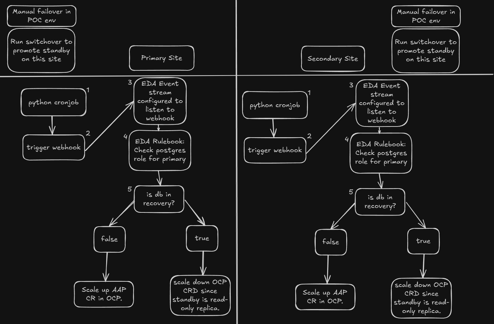
[Diagram generated by Excalidraw](https://excalidraw.com/)

## Prerequisites
- Two indepentent Openshift clusters 
    - As of writing, this has been tested on Openshift v4.16.x & 4.17.x. 
- Independent AAP 2.5 deployment with EDA, of your desired topology (RPM, Containerized, Operator). 
    - [RPM Topology](https://docs.redhat.com/en/documentation/red_hat_ansible_automation_platform/2.5/html/rpm_installation/index)
    - [Containerized Topology](https://docs.redhat.com/en/documentation/red_hat_ansible_automation_platform/2.5/html/containerized_installation/index)
    - [Operator Topology](https://docs.redhat.com/en/documentation/red_hat_ansible_automation_platform/2.5/html/installing_on_openshift_container_platform/index)
- Openshift Service Accounts - one per OCP cluster with access to the AAP namespaces to control CR's. 
- Postgres v13 cluster - external to Openshift.
- AAP 2.4 components configured and deployed in Openshift to use the external Postgres cluster.
    - Feel free to use another repo of mine as an example: [AAP-on-OCP](https://github.com/hammer-redhat/aap-on-ocp)
- Ability to perform manual switchover by promoting the standby PostgreSQL instance to primary (or other failover triggers as needed).

## Playbooks
- Deploy postgres script: This playbook deploys the two python scripts from the files directory (postgres_check_site1.py  & postgres_check_site2.py) and configured a cronjob to run them every minute. There is an example postgres_check you can use to populate these files with your DB connection settings. 
- Failover EDB: These playbooks were created to simplify triggering the database failover on the EnterpriseDB PostgreSQL cluster we deployed. It utilized the playbooks shipped with tpaexec and is located here - `/opt/EDB/TPA/architectures/M1/commands/switchover.yml`. You can ignore using these playbooks as they're used for demonstrating failover scenarios for this use case.
-  Scale up/down AAP: These playbooks use the `redhat.openshift.k8s` module to apply changes to AAP Custom Resources in Openshift. The playbooks use the following files in this repo:  
    - Scaling up Automation Controller:   
        - [Controller Site 1](https://github.com/hammer-redhat/aap-multisite-failover-eda/blob/main/playbooks/controller/scale_up_aap-site1.yml)
        - [Controller Site 2](https://github.com/hammer-redhat/aap-multisite-failover-eda/blob/main/playbooks/controller/scale_up_aap-site2.yml)
    - Scaling up Automation Hub: 
        - [Hub Site 1](https://github.com/hammer-redhat/aap-multisite-failover-eda/blob/main/playbooks/hub/scale_up_hub-site1.yml)
        - [Hub Site 2](https://github.com/hammer-redhat/aap-multisite-failover-eda/blob/main/playbooks/hub/scale_up_hub-site2.yml)
    - Scaling down Automation Controller:
        - [Controller Site 1](https://github.com/hammer-redhat/aap-multisite-failover-eda/blob/main/playbooks/controller/scale_down_aap-site1.yml)
        - [Controller Site 2](https://github.com/hammer-redhat/aap-multisite-failover-eda/blob/main/playbooks/controller/scale_down_aap-site2.yml)
    - Scaling down Automation Hub: 
        - [Hub Site 1](https://github.com/hammer-redhat/aap-multisite-failover-eda/blob/main/playbooks/hub/scale_down_hub-site1.yml)
        - [Hub Site 2](https://github.com/hammer-redhat/aap-multisite-failover-eda/blob/main/playbooks/hub/scale_down_hub-site2.yml)

## Rulebooks
- There are four rulebooks preconfigured for you, one to monitor postgres per site for both Automation Controller and Hub. 
    - Controller:
        - [Monitor Controller PG Site 1](https://github.com/hammer-redhat/aap-multisite-failover-eda/blob/main/rulebooks/controller_pg_monitor_rulebook_site1.yml)
        - [Monitor Controller PG Site 2](https://github.com/hammer-redhat/aap-multisite-failover-eda/blob/main/rulebooks/controller_pg_monitor_rulebook_site2.yml)
    - Hub:
        - [Monitor Hub PG Site 1](https://github.com/hammer-redhat/aap-multisite-failover-eda/blob/main/rulebooks/hub_pg_monitor_rulebook_site1.yml)
        - [Monitor Hub PG Site 2](https://github.com/hammer-redhat/aap-multisite-failover-eda/blob/main/rulebooks/hub_pg_monitor_rulebook_site2.yml)
- These will be the rulebooks that are configured to listen to the `Event Streams` you'll setup later.
- These rulebooks trigger based on the webhook data that's returned in the payload `payload.in_recovery` with a result of `true` or `false`. 
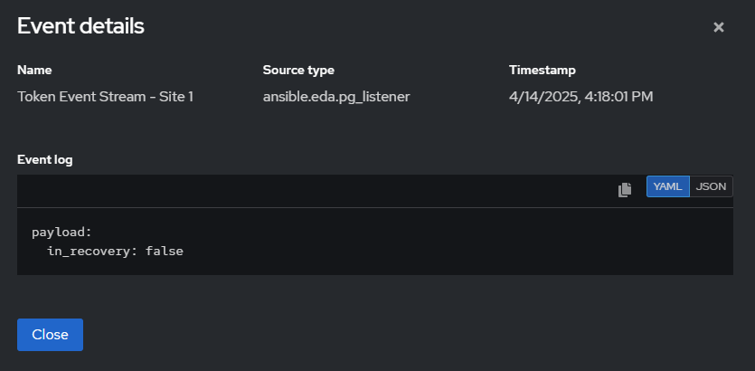

## Execution Environment
- There is one execution environment that is required to be used that includes the `redhat.openshift` collection and that is included here and can be built using the following steps as an example. 
```
ansible-builder build -f execution_environment/k8s_ee.yml -t k8s_ee
podman images # grab the Image ID to then push to automation hub.
podman login aap.example.com
podman push <paste Image ID> aap.example.com/namespace_example/k8s_ee
```

## Usage
To use AAP Multi Site Failover EDA in AAP:  

1. Create a project in **AAP Controller and EDA** and sync both:
2. Create an inventory and populate it with Postgres cluster hosts, ensure they're enabled.
3. Credentials in Controller - You will need to create Openshift Token credentials in AAP to authenticate into Openshift and scale your CR's accordingly.
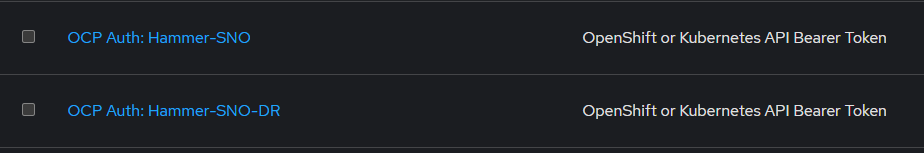
4. Ensure you have created and pushed an execution environment with the `redhat.openshift` and `ansible.eda collections`.
5. Create the four job templates using the scale up/down playbooks for each site. This equals out to 2 job templates per site (up/down playbooks are separate) and 4 playbooks total across both sites. Note that for these playbooks you will need to use your Openshift API credential created earlier as well as the `k8s_ee` as an execution environment that has the `redhat.openshift` collection installed. 
Once complete you should have four playbooks:
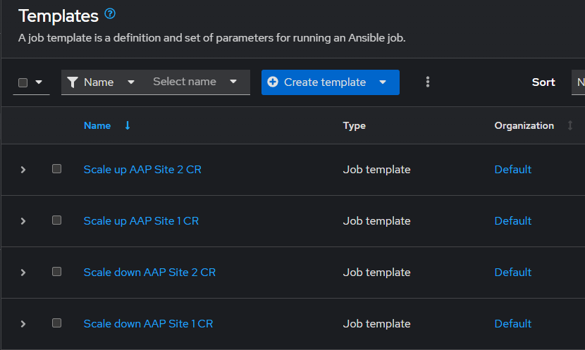
6. With all of the playbooks configured you can now swap over to the `Automation Decisions - Event-Driven Ansible` tab on the left side of the screen to configure the following:
    - Credentials: You will need to create a container registry credential to sync the decision environment from registry.redhat.io as well as a RH-AAP Credential for EDA to trigger playbook runs from events received. 
        - Registry Credential
        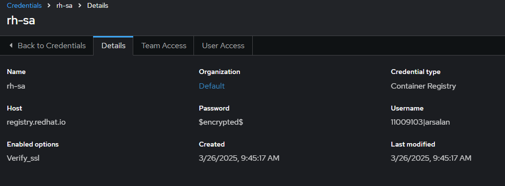
        - AAP API Credential
        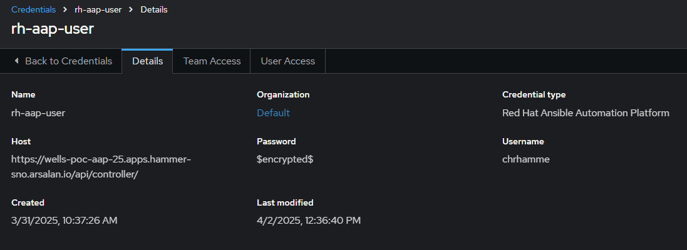
        - Token Event Stream - copy the token and place it into the postgres_check_site.py files. 
        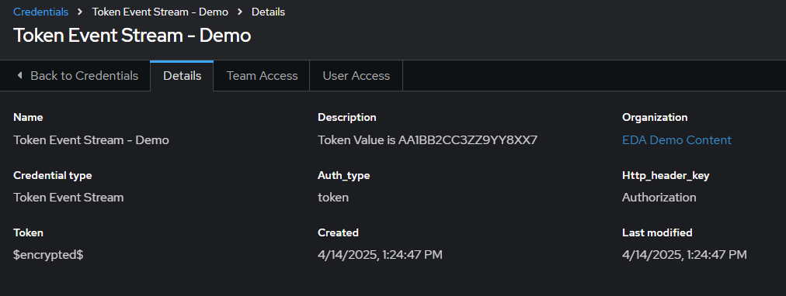
7. Now create and configure the decision environment.
    - Decision Environment: A container that has the required dependencies and collections to run the ansible.eda collection. Luckily, our `de-supported-rhelX` images have this already. 
    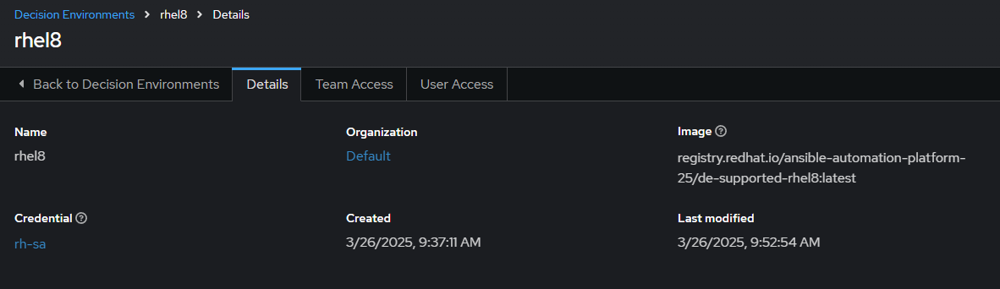
8. Create the same project from earlier in the Automation Controller, but inside of the EDA console. 
9. Configure event streams:
    - Create the event streams using the screenshot as a reference. Note that for site 1 and site 2, you'll receive a unique URL for each. Copy them and place them into the respective postgres_check_site.py file in the `webhook_url` portion.  
    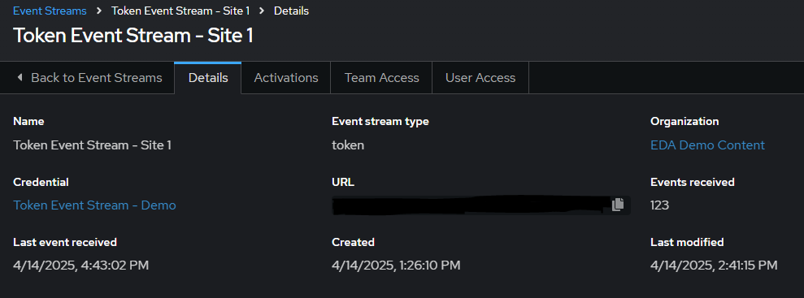
    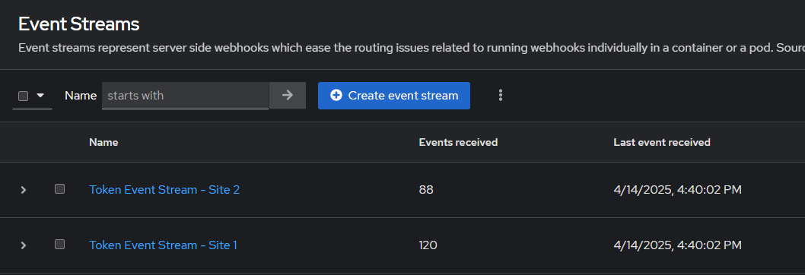
10. Deploy the postgres scripts to either the primary/standby db nodes or a bastion node that has network access to reach the db cluster.
    - The `deploy_postgres_check.yml` playbook is included in this repo, feel free to use it or manually create the entries in crontab, as well as deploy the python scripts to a bastion node or the db cluster. 
11. 
    - Rulebook Activations: Now you can tie it all together by creating rulebook activations for Sites 1 & 2. 
    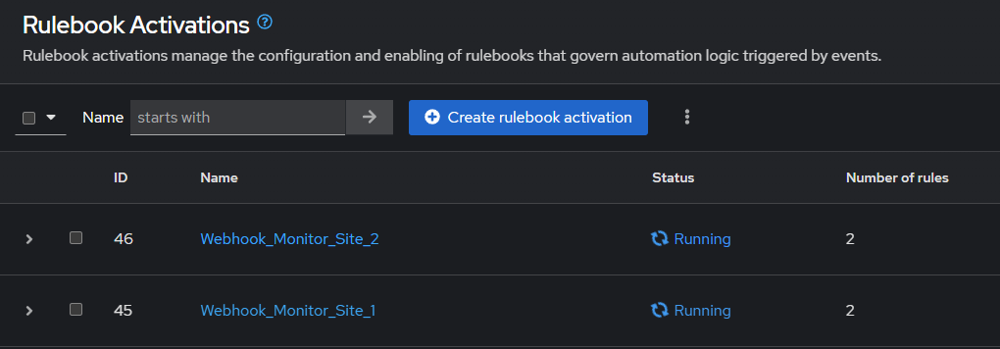
        - Configure the Rulebook activations according to the screenshot example. 
        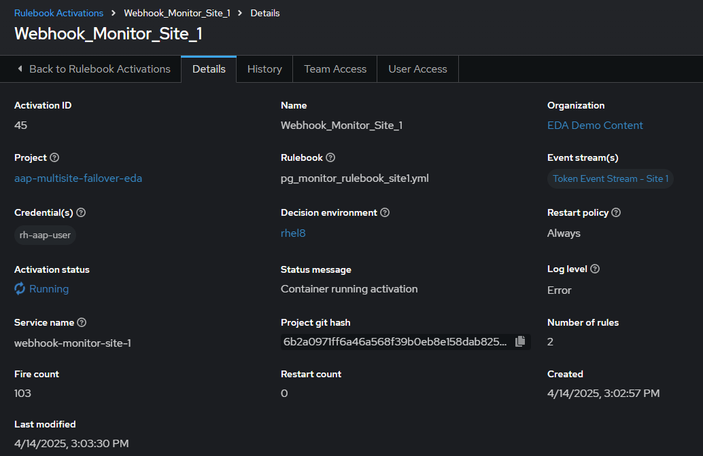
        - Repeat this process for site 2 and tailor the variables accordingly. 
        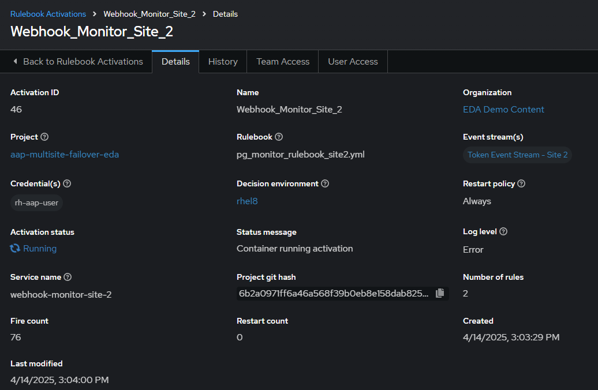

## Examples
## Failover
- Failover from `Site 1 -> 2`.
    1. Primary db is currently located in Site 1.
        ```
        [chammer@hammer-bastion ~]$ oc get pods | grep controller-edb
        controller-edb-01-task-7bbd7c7f6d-gn42v                           4/4     Running   0          90m
        controller-edb-01-web-5d98c76bcf-xmm7z                            3/3     Running   0          90m
        ```
    2. Now we'll trigger a failover scenario and wait for the database to come up on site 2. 
    3. Once the failover has completed you'll notice that the rulebooks will detect the change and trigger the appropriate scale up/down playbooks. 
        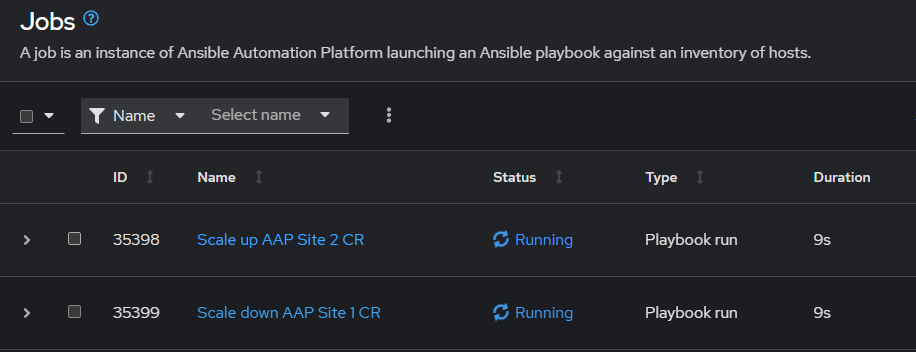
    4. If you navigate to Automation Decisions (Event-Driven Ansible) in AAP's console and click on the `Rule Audit` tab, you can see all of the triggered events from the rulebooks. From here you can find the payload that was sent from the python script watching the site 2 database. Which ultimately sent the payload -> `in_recovery: false` which triggered it to scale up.
        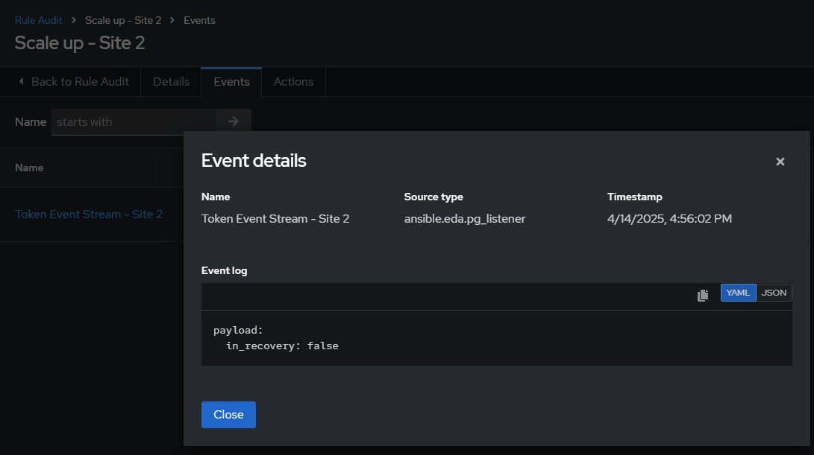
    5. The estimated time to failover the AAP application layer is roughly 1-2 minutes. 
    6. Verify that the controller and task pods spun up appropriately. 
        ```
        $ oc get pods | grep controller-edb
        controller-edb-02-task-bb9cc7c69-xmg9m                            4/4     Running   0          7m2s
        controller-edb-02-web-f769b9684-w6z6b                             3/3     Running   0          7m
        ```
    
