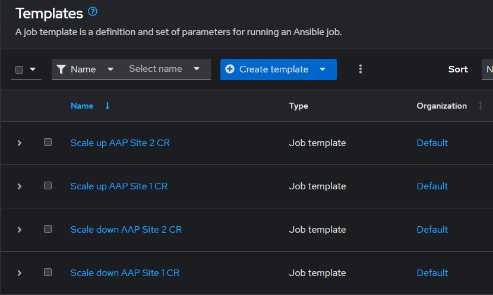
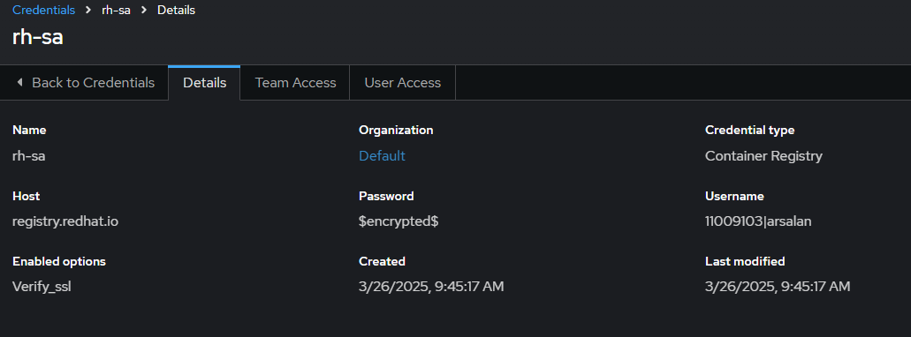
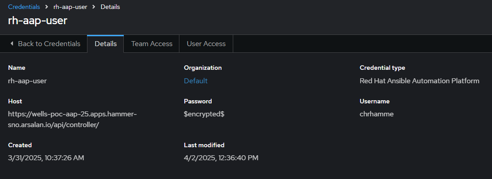
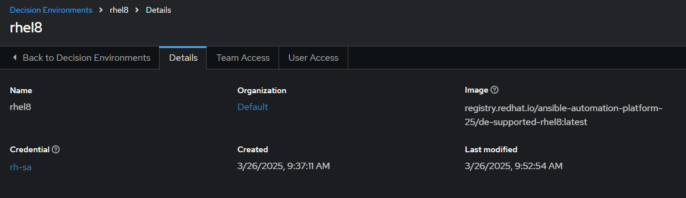
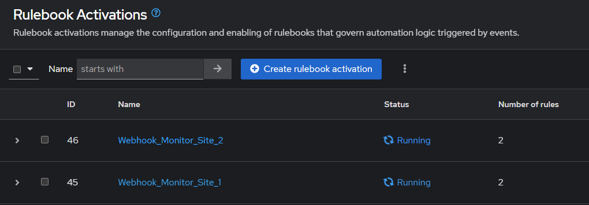
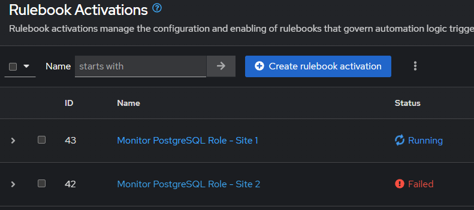

# AAP Multi Site Failover EDA

AAP Multi Site Failover EDA is a project designed to monitor and failover a multi-site Ansible Automation Platform deployment on two independent Openshift clusters with a shared external database cluster running postgres 13. 

## Table of Contents

- [Overview](#overview)
- [Features](#features)
- [Installation](#installation)
- [Usage](#usage)
- [Examples](#examples)

## Overview

AAP Multi Site Failover EDA accomplishes automated failover by triggering webhooks and configuring EDA to take action when events are sent via webhook.

## Collections
```
cat requirements.yml
---
collections:
  redhat.openshift
  ansible.eda
```

## Features   
## Playbooks:
- Check PostgreSQL Database Role: This playbook runs a psql command to determine if the postgres instance is one of the following: _'Primary/Leader, Standby or offline'_.
- Deploy PostgreSQL Trigger: This playbook determines if the `pg_notify` trigger exists, if it doesn't it configures it by running the `files/queue.sql` script located in this repo. 
- Failover EDB: These playbooks were created to simplify triggering the database failover on the EnterpriseDB PostgreSQL cluster we deployed. It utilized the playbooks shipped with tpaexec and is located here - `/opt/EDB/TPA/architectures/M1/commands/switchover.yml`. You can ignore using these playbooks as they're used for demonstrating failover scenarios for this use case.
-  Scale up/down AAP: These playbooks use the `redhat.openshift.k8s` module to apply changes to AAP Custom Resources in Openshift. The playbooks use the following files in this repo:  
    - Scaling up:   
        - aap-cr-up-site1.yml  
        - aap-cr-up-site2.yml
    - Scaling down: 
        - aap-cr-down-site1.yml
        - aap-cr-down-site2.yml
    - These files change line 30 in the files from `replicas: 0` -> `replicas: 1` when scaling up and vice versa.  

## Rulebooks:
- There are two rulebooks preconfigured for you, one to monitor postgres per site. 
    - pg_monitor_rulebook_site1.yml
    - pg_monitor_rulebook_site2.yml
- Within these rulebooks the source is `ansible.eda.pg_listener`. This listens to events published by `pg_notify` commands run in the `check_postgres_role.yml` playbook. 
- After the sources in the rulebook you'll see that they each have two rules based on the `event.postgres_db_role` output generated by the `check_postgres_role.yml` playbook. These trigger the scale up/down functions based on if the condition is met. 

## Execution Environment:
- There is one execution environment that is required to be used that includes the `redhat.openshift` collection and that is included here and can be built using the following steps as an example. 
```
ansible-builder build -f execution_environment/k8s_ee.yml -t k8s_ee
podman images # grab the Image ID to then push to automation hub.
podman login aap.example.com
podman push <paste Image ID> aap.example.com/namespace_example/k8s_ee
```
## Workflow Diagram: 
.png>)

## Installation

To clone and use this project from CLI, follow these steps:

1. **Clone the repository:**

```bash
git clone https://github.com/hammer-redhat/watch-tower-eda.git
```
Navigate to the project directory:
```
cd watch-tower-eda
```
Install dependencies:
```
ansible-galaxy collection install -r requirements.yml
```
## Usage
## Usage in Ansible Automation Platform:
To use AAP Multi Site Failover EDA in AAP:  

1. Create a project in **AAP Controller and EDA** and sync both:
2. Create an inventory and populate it with Postgres cluster hosts, ensure they're enabled.
3. Credentials - You will need to create Openshift Token credentials in AAP to authenticate into Openshift and scale your CR's accordingly.

8. Finally create the four job templates using the scale up/down playbooks for each site. This equals out to 2 job templates per site (up/down playbooks are separate) and 4 playbooks total across both sites. Note that for these playbooks you will need to use your Openshift API credential created earlier as well as the `k8s_ee` as an execution environment that has the `redhat.openshift` collection installed. 
Once complete you should have four playbooks:

9. With all of the playbooks configured you can now swap over to the `Automation Decisions - Event-Driven Ansible` tab on the left side of the screen to configure the following:
    - Credentials: You will need to create a container registry credential to sync the decision environment from registry.redhat.io as well as a RH-AAP Credential for EDA to trigger playbook runs from events received. 
        - Registry Credential
        
        - AAP API Credential
        
    - Decision Environment: A container that has the required dependencies and collections to run the ansible.eda collection. Luckily, our `de-supported-rhelX` images have this already. 
    
    - Project: This should have already been done but in the case you forgot to also create and sync the project in EDA, please do so now. 
    - Rulebook Activations: Now you can tie it all together by creating rulebook activations for Sites 1 & 2. 
    
        - Repeat this process for site 2 and tailor the variables accordingly. 

## Examples
## Failover
- Failover from `Site 1 -> 2`.
    - Primary db is currently located in Site 1. Ignore the failure for Site 2, since it's read-only standby mode for now.
    
    
