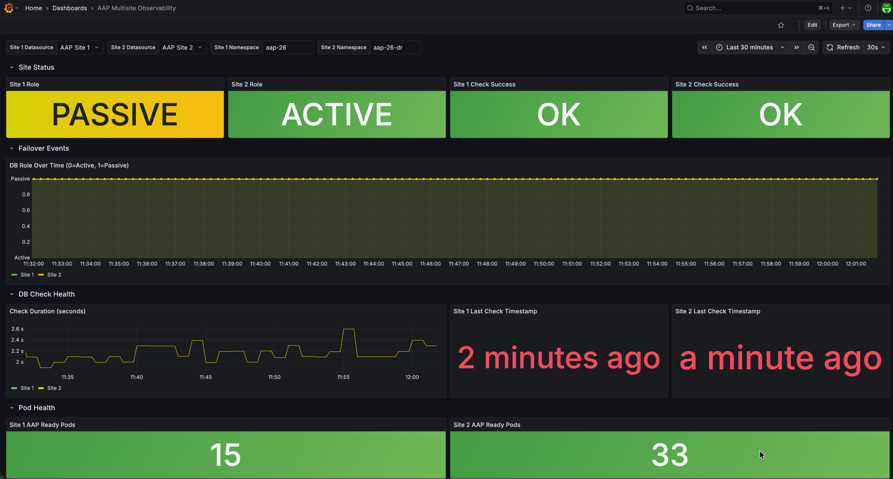

# Ansible Automation Platform - Multi-Site Failover using Event-Driven Ansible

## Table of Contents

- [Overview](#overview)
- [Architecture](#architecture)
- [Prerequisites](#prerequisites)
- [Configuration](#configuration)
- [Playbooks](#playbooks)
- [Rulebooks](#rulebooks)
- [Usage](#usage)
- [Observability Dashboard](#observability-dashboard)
- [Failover Example](#failover-example)

---

## Overview

This repository implements an **active/standby multi-site disaster recovery pattern** for Red Hat Ansible Automation Platform (AAP) 2.6 on OpenShift, using **Event-Driven Ansible (EDA)** to automatically scale the AAP stack up or down based on PostgreSQL primary/standby role detection.

> **Note:** This is a proof-of-concept (POC). It demonstrates the AAP application-layer failover mechanism and is not a production-ready HA solution for every AAP component.

### How it works

1. **Monitoring** — A Python script (run as a CronJob or cron daemon) queries `pg_is_in_recovery()` on the local PostgreSQL instance every minute and POSTs the result to an EDA Event Stream webhook.

2. **Decision** — An EDA Rulebook processes the `payload.in_recovery` field from the webhook payload and determines the action to take:
   - `in_recovery: false` → Database is **primary** → **Scale up** the AAP Custom Resources (CRs) in OpenShift.
   - `in_recovery: true` → Database is a **standby/replica** → **Scale down** the AAP CRs.

3. **Scaling** — AAP Controller job templates use the `redhat.openshift.k8s` module to patch the `idle_aap` / `idle_deployment` field on the `AnsibleAutomationPlatform`, `AutomationController`, `AutomationHub`, and `EDA` CRs in OpenShift.

4. **Symmetry** — Both sites run identical monitoring and decision logic. Whichever site holds the PostgreSQL primary scales up; the other scales down.

---

## Architecture

The overall flow across two independent OpenShift clusters:

```
 Site 1 (OCP Cluster)                    Site 2 (OCP Cluster)
┌─────────────────────────────┐          ┌─────────────────────────────┐
│  Postgres Check (CronJob)   │          │  Postgres Check (CronJob)   │
│  pg_is_in_recovery()        │          │  pg_is_in_recovery()        │
│  → POST {in_recovery: T/F}  │          │  → POST {in_recovery: T/F}  │
└────────────┬────────────────┘          └────────────┬────────────────┘
             │  webhook                               │  webhook
             ▼                                        ▼
┌─────────────────────────────┐          ┌─────────────────────────────┐
│  EDA Event Stream (Site 1)  │          │  EDA Event Stream (Site 2)  │
│  Rulebook Activation        │          │  Rulebook Activation        │
│  gateway_pg_monitor_site1   │          │  gateway_pg_monitor_site2   │
└────────────┬────────────────┘          └────────────┬────────────────┘
             │  run_job_template                       │  run_job_template
             ▼                                        ▼
┌─────────────────────────────────────────────────────────────────────┐
│                       AAP Controller                                │
│   Job Template: "Scale up/down Gateway Site 1/2 CR"                │
│   Playbook: scale-aap-gateway.yml or scale-gateway-controller-eda   │
│   Patches: AnsibleAutomationPlatform.spec.idle_aap                  │
│            AutomationController.spec.idle_deployment                │
│            AutomationHub.spec.idle_deployment                       │
│            EDA.spec.idle_deployment                                 │
└─────────────────────────────────────────────────────────────────────┘
```

---

## Prerequisites

- **Two independent OpenShift clusters** (tested on OpenShift v4.16.x and v4.17.x).
- **AAP 2.6 Operator** available in OperatorHub on both clusters (channel `stable-2.6`).
- **External PostgreSQL cluster** (v13+) with replication configured between sites.
  - Ansible does not manage the database replication itself; it only reacts to the role of the local DB instance.
  - For demonstration failover, the repo includes helpers for EnterpriseDB / TPA (`tpaexec`).
- **OpenShift Service Accounts** — one per OCP cluster, with access to the AAP namespace to create and patch CRs.
- **Registry access** to `registry.redhat.io` for AAP operator images and the `de-supported-rhelX` decision environment image.
- **Ansible controller** (or local machine) with:
  - `ansible-galaxy collection install -r requirements.yml`
  - `pip install psycopg2-binary` (for `configure_external_db.yml`)

---

## Configuration

All configuration lives in `vars/main.yml`. This file is gitignored. Copy the example and fill in your values:

```bash
cp vars/main.yml.example vars/main.yml
```

### Key variable groups

| Group | Variables | Description |
|-------|-----------|-------------|
| Namespaces | `namespace_site_one`, `namespace_site_two` | OpenShift namespaces per site (e.g. `aap-26`, `aap-26-dr`) |
| AAP instance | `aap_instance_name` | Must match the `AnsibleAutomationPlatform` CR name; used by Hub PVC naming |
| Postgres admin | `postgres_admin_user`, `postgres_admin_password`, `postgres_configure_host` | Admin credentials used by `configure_external_db.yml` |
| DB hosts | `db_host_site_one`, `db_host_site_two`, `db_port`, `db_sslmode` | Per-site Postgres endpoints |
| Per-service DB creds | `db_name_*`, `db_username_*`, `db_password_*` | Separate credentials for controller, eda, hub, gateway |
| AAP secrets | `controller_admin_password`, `aap_admin_password`, `controller_secret_key`, `automationhub_db_fields_encryption_key`, `aap_db_fields_encryption_key`, `aap_eda_db_fields_encryption_key` | Applied as Kubernetes Secrets before the AAP CR |
| Hub content storage | `hub_content_storage_type` | `""` (operator default), `s3`, `azure`, or `file` — choose one backend |

See `vars/main.yml.example` for the full list of variables and per-backend Hub storage options (S3, Azure Blob, dynamic NFS, static NFS).

> **Security:** Never commit `vars/main.yml`. All sensitive values are rendered into Kubernetes Secrets via Jinja2 templates in `operator_crs/secrets/`.

---

## Playbooks

### AAP Deployment (`playbooks/setup_aap_instances/`)

These playbooks deploy the full AAP 2.6 operator stack to each OpenShift cluster. Run them once during initial setup.

| Playbook | Purpose |
|----------|---------|
| `deploy_aap_site_one.yml` | Deploys operator subscription, secrets, optional Hub storage (S3/Azure/NFS), and the `AnsibleAutomationPlatform` CR to site one |
| `deploy_aap_site_two.yml` | Same for site two |
| `configure_external_db.yml` | Creates PostgreSQL superuser roles and databases (controller, hub, gateway, eda) using `community.postgresql` |

**Deploy sequence (per site):**

1. Validate Hub content storage variables
2. Apply `subscription.yml` — creates the `Namespace`, `OperatorGroup`, and `Subscription`
3. Pause 30 seconds for operator install
4. Optionally apply NFS PV/PVC manifests (if `hub_file_storage_provisioning: static_nfs`)
5. Template and apply all Secret manifests
6. Apply the `AnsibleAutomationPlatform` CR

**Running the DB setup:**

```bash
# Site one DB (default host from vars/main.yml)
ansible-playbook playbooks/setup_aap_instances/configure_external_db.yml

# Site two DB
ansible-playbook playbooks/setup_aap_instances/configure_external_db.yml \
  -e postgres_configure_host="{{ db_host_site_two }}"
```

### Gateway Scaling (`playbooks/gateway_scaling/`)

These playbooks are called by AAP Controller job templates in response to EDA events. They patch the `idle_aap` / `idle_deployment` field on all relevant CRs.

| Playbook | Components scaled |
|----------|-------------------|
| `scale-aap-gateway.yml` | `AnsibleAutomationPlatform`, `AutomationController`, `AutomationHub`, `EDA` |
| `scale-gateway-controller-eda.yml` | `AnsibleAutomationPlatform`, `AutomationController`, `EDA` (no Hub) |

**Required extra vars for both playbooks:**

```yaml
gateway_cr_name: "aap-26"          # AnsibleAutomationPlatform CR name
gateway_cr_namespace: "aap-26"     # Namespace for all CRs
controller_cr_name: "aap-26"       # AutomationController CR name
eda_cr_name: "aap-26"              # EDA CR name
idle_aap: false                     # false = scale UP, true = scale DOWN
```

For `scale-aap-gateway.yml` only:

```yaml
hub_cr_name: "aap-26"             # AutomationHub CR name
```

### Postgres Monitoring Deployment (`playbooks/deploy_postgres_check.yml`)

Deploys Python postgres check scripts and configures cron jobs on bastion or DB nodes. The scripts POST `{"in_recovery": true|false}` to an EDA Event Stream webhook every minute.

> **Modern alternative:** Use the containerized approach in `files/postgres_checks/` — build the Docker image and deploy the included `openshift-deployment.example.yaml` as an OpenShift CronJob instead.

### Observability Dashboard (`playbooks/deploy_dashboard/`)

Deploys a Prometheus metrics sidecar to both clusters and provisions a centralized Grafana instance with a side-by-side view of both sites' health, active/passive status, and failover history.



| File | Purpose |
|------|---------|
| `deploy_dashboard.yml` | Top-level playbook — applies OCP manifests then provisions Grafana |
| `tasks/apply_ocp_manifests.yml` | Creates `postgres-check-db` Secret, applies `aap-site-metrics` Deployment, Service, ServiceMonitor, PrometheusRule, and RBAC to one cluster |
| `tasks/provision_datasources.yml` | Creates two Prometheus datasources in Grafana (one per cluster's Thanos Querier) |
| `tasks/provision_dashboard.yml` | Imports `files/grafana/dashboard.json` into Grafana |
| `tasks/provision_alerts.yml` | Creates cross-site Grafana alert rules (`AAPSiteSplitBrain`, `AAPNoPrimary`) |

The `postgres_check` container supports a `MODE=metrics` option (alongside the existing `MODE=cron` default) that exposes four Prometheus gauges on `:8080/metrics`:

| Metric | Description |
|--------|-------------|
| `aap_site_in_recovery` | `0` = active/primary, `1` = passive/standby |
| `aap_pg_check_success` | `1` = last DB check succeeded, `0` = failed |
| `aap_pg_check_last_run_timestamp_seconds` | Unix timestamp of last successful check |
| `aap_pg_check_duration_seconds` | Duration of last DB query |

### Database Failover Helpers (`playbooks/database_failover/`)

Demo playbooks that trigger an EDB TPA database switchover using `tpaexec`. These are optional helpers for demonstrating a failover scenario — EDA reacts to the role change automatically once the DB is promoted.

| Playbook | Purpose |
|----------|---------|
| `failover_edb_to_site1.yml` | Promotes site 1 PostgreSQL to primary via `tpaexec` |
| `failover_edb_to_site2.yml` | Promotes site 2 PostgreSQL to primary via `tpaexec` |

---

## Rulebooks

Two rulebooks are provided — one per site. Each listens on a dedicated EDA Event Stream webhook and fires the appropriate Controller job template based on the `in_recovery` field.

| Rulebook | Event Stream |
|----------|-------------|
| `rulebooks/gateway_pg_monitor_rulebook_site1.yml` | Site 1 Event Stream |
| `rulebooks/gateway_pg_monitor_rulebook_site2.yml` | Site 2 Event Stream |

**Decision logic (same for both sites):**

```yaml
# payload.in_recovery == false  →  DB is PRIMARY  →  Scale UP
- condition: event.payload.in_recovery == false
  action:
    run_job_template:
      name: "Scale up Gateway Site 1 CR"
      organization: "AAP-Multisite-Failover"

# payload.in_recovery == true   →  DB is STANDBY  →  Scale DOWN
- condition: event.payload.in_recovery == true
  action:
    run_job_template:
      name: "Scale down Gateway Site 1 CR"
      organization: "AAP-Multisite-Failover"
```

The job template names must match exactly in your AAP Controller. The organization name defaults to `"AAP-Multisite-Failover"`.

---

## Usage

### 1. Install collections and configure variables

```bash
ansible-galaxy collection install -r requirements.yml
pip install psycopg2-binary

cp vars/main.yml.example vars/main.yml
# Edit vars/main.yml with your site-specific values
```

### 2. Prepare the external PostgreSQL databases

Run `configure_external_db.yml` against each site's PostgreSQL host to create the required users and databases:

```bash
ansible-playbook playbooks/setup_aap_instances/configure_external_db.yml
ansible-playbook playbooks/setup_aap_instances/configure_external_db.yml \
  -e postgres_configure_host="{{ db_host_site_two }}"
```

### 3. Deploy AAP to both OpenShift clusters

Authenticate your Ansible environment to each cluster (via `K8S_AUTH_*` env vars or kubeconfig), then run:

```bash
# Site one
ansible-playbook playbooks/setup_aap_instances/deploy_aap_site_one.yml

# Site two (standby — start with DB in recovery so AAP idles at this site)
ansible-playbook playbooks/setup_aap_instances/deploy_aap_site_two.yml
```

### 4. Build or pull an execution environment

The gateway scaling playbooks require an execution environment with the `redhat.openshift` collection. You can build one:

```bash
ansible-builder build -f execution_environment/k8s_ee.yml -t k8s_ee
podman push <image-id> <your-automation-hub>/namespace/k8s_ee
```

Or use any EE that already includes `redhat.openshift >= 4.0.0`.

### 5. Set up AAP Controller

In **Automation Controller**:

1. **Project** — Sync this repository.
2. **Inventory** — Add an inventory with your PostgreSQL cluster / bastion hosts (for `deploy_postgres_check.yml`) or use the `localhost` inventory for scaling playbooks.
3. **OpenShift credential** — Create an OpenShift API Token credential for each cluster.
4. **Job templates** — Create four job templates (two per site: scale up and scale down):

   | Template name | Playbook | Extra vars |
   |---------------|----------|------------|
   | `Scale up Gateway Site 1 CR` | `playbooks/gateway_scaling/scale-aap-gateway.yml` | `gateway_cr_name`, `gateway_cr_namespace`, `controller_cr_name`, `hub_cr_name`, `eda_cr_name`, `idle_aap: false` |
   | `Scale down Gateway Site 1 CR` | `playbooks/gateway_scaling/scale-aap-gateway.yml` | same vars, `idle_aap: true` |
   | `Scale up Gateway Site 2 CR` | `playbooks/gateway_scaling/scale-aap-gateway.yml` | same vars pointing at site 2, `idle_aap: false` |
   | `Scale down Gateway Site 2 CR` | `playbooks/gateway_scaling/scale-aap-gateway.yml` | same vars pointing at site 2, `idle_aap: true` |

   Use your OpenShift API credential and the `k8s_ee` execution environment for all four templates.

   > If you do not deploy Automation Hub, use `scale-gateway-controller-eda.yml` instead and omit `hub_cr_name`.

### 6. Set up Event-Driven Ansible

In **Automation Decisions (EDA)**:

1. **Registry credential** — Create a container registry credential for `registry.redhat.io`.
2. **AAP API credential** — Create an RH-AAP credential so EDA can trigger Controller job templates.
3. **Decision environment** — Use `de-supported-rhel8` or `de-supported-rhel9` from `registry.redhat.io`. These images include the `ansible.eda` collection.
4. **Project** — Sync this repository in EDA (same repo as Controller).
5. **Event Streams** — Create two event streams (one per site). Copy each unique webhook URL and token into your postgres check scripts or CronJob secrets.
6. **Rulebook activations** — Create one activation per rulebook:
   - `gateway_pg_monitor_rulebook_site1.yml` → Site 1 Event Stream
   - `gateway_pg_monitor_rulebook_site2.yml` → Site 2 Event Stream

   Set the organization to `AAP-Multisite-Failover` (or update the rulebooks to match your organization name).

### 7. Deploy the Postgres monitoring script

> **The monitoring CronJob must be deployed on both Site 1 and Site 2.** Each site runs its own check against its local PostgreSQL instance and reports to its own EDA Event Stream.

**Option A — cron daemon on bastion/DB nodes (legacy):**

Populate the postgres check scripts from `files/postgres_checks/postgres_check_example.py` (one per site), then run:

```bash
ansible-playbook playbooks/deploy_postgres_check.yml -i inventory/
```

> This playbook expects pre-populated `files/postgres_check_site1.py` and `files/postgres_check_site2.py` scripts with site-specific credentials hardcoded. Use Option B for new deployments.

**Option B — OpenShift CronJob (recommended):**

> This must be deployed once per site — each site needs its own Secrets pointing at that site's PostgreSQL database and EDA Event Stream.

**Step 1 — Check your OCP node architecture** (the container image must match the nodes, not your laptop):

```bash
oc get nodes -o jsonpath='{.items[0].status.nodeInfo.architecture}{"\n"}'
```

**Step 2 — Build and push the container image** from `files/postgres_checks/`:

```bash
cd files/postgres_checks/

# Build for the correct platform (amd64 is most common; use arm64 if nodes report arm64):
podman build --platform linux/amd64 -t <your-registry>/postgres-check:v1 .
podman push <your-registry>/postgres-check:v1
```

> Mismatched architecture causes `Exec format error` at runtime. See the comment block at the top of `files/postgres_checks/openshift-deployment.example.yaml` for full details.

**Step 3 — Create site-specific copies of the manifest** and update the following fields for each site:

```bash
cp files/postgres_checks/openshift-deployment.example.yaml openshift-deployment-site1.yaml
cp files/postgres_checks/openshift-deployment.example.yaml openshift-deployment-site2.yaml
```

In each copy, update these fields:

| Field | Object | What to set |
|-------|--------|-------------|
| `WEBHOOK_URL` | `postgres-check-webhook` Secret | EDA Event Stream URL for this site (from step 6) |
| `AUTH_TOKEN` | `postgres-check-webhook` Secret | EDA Event Stream token for this site (from step 6) |
| `DB_CONFIG` | `postgres-check-db` Secret | JSON object with this site's gateway DB credentials (see below) |
| `image:` | Job and CronJob `containers` spec | Replace `quay.io/chrhamme/postgres-check:v4` with your pushed image |
| `schedule:` | CronJob spec | `"* * * * *"` runs every minute; use `"*/5 * * * *"` for production |

**`DB_CONFIG` format** — maps directly to variables in `vars/main.yml`:

```json
{
  "host": "<db_host_site_one>",
  "port": 5432,
  "dbname": "<db_name_gateway>",
  "user": "<db_username_gateway>",
  "password": "<db_password_gateway>"
}
```

For Site 2, substitute `db_host_site_two` for `host`. The `dbname`, `user`, and `password` values come from the `db_name_gateway`, `db_username_gateway`, and `db_password_gateway` variables in your `vars/main.yml`.

Alternatively, omit `DB_CONFIG` entirely and use individual keys (`PGHOST`, `PGUSER`, `PGPASSWORD`, `PGPORT`, `PGDATABASE`) — the script reads either form.

**Step 4 — Apply to both sites** using the appropriate cluster credentials and namespace for each:

```bash
# Site 1 — namespace must match namespace_site_one in vars/main.yml (default: aap-26)
oc apply -n aap-26 -f openshift-deployment-site1.yaml

# Site 2 — namespace must match namespace_site_two in vars/main.yml (default: aap-26-dr)
oc apply -n aap-26-dr -f openshift-deployment-site2.yaml
```

### 8. Deploy the observability dashboard

Provisions the `aap-site-metrics` Deployment on both clusters (Prometheus metrics mode), applies User Workload Monitoring manifests, and configures your centralized Grafana instance with datasources, the side-by-side dashboard, and cross-site alert rules.

**Prerequisites:**

- OCP User Workload Monitoring enabled on both clusters (`enableUserWorkload: true` in the `cluster-monitoring-config` ConfigMap)
- A Grafana service account token with Editor role for your Grafana instance
- An OCP Service Account token with `cluster-monitoring-view` role on each cluster for Thanos Querier access

> **Note:** The `postgres-check-db` Secret is created automatically by the playbook from your `vars/main.yml` values — no pre-population required.

**Add these variables to `vars/main.yml`** (see `vars/main.yml.example` for full descriptions):

| Variable | Description |
|----------|-------------|
| `grafana_url` | Base URL of your Grafana instance, e.g. `https://grafana.example.com` |
| `grafana_api_token` | Grafana service account token (Editor role) |
| `postgres_check_image` | Container image to use, e.g. `quay.io/chrhamme/postgres-check:v4` |
| `thanos_querier_site_one` | Thanos Querier hostname for Site 1 (no scheme, no port) |
| `thanos_querier_site_two` | Thanos Querier hostname for Site 2 (no scheme, no port) |
| `thanos_bearer_token_site_one` | OCP SA token with `cluster-monitoring-view` on Site 1 |
| `thanos_bearer_token_site_two` | OCP SA token with `cluster-monitoring-view` on Site 2 |
| `site_label_one` | Short label for Site 1 metrics (default: `site1`) |
| `site_label_two` | Short label for Site 2 metrics (default: `site2`) |

**Find your Thanos Querier hostname:**

```bash
oc -n openshift-monitoring get route thanos-querier -o jsonpath='{.spec.host}'
```

**Create a monitoring-view token for each cluster:**

```bash
oc -n openshift-monitoring create token prometheus-k8s --duration=8760h
```

**Run the playbook:**

```bash
ansible-playbook playbooks/deploy_dashboard/deploy_dashboard.yml \
  -e k8s_context_site_one=<your-site1-kubeconfig-context> \
  -e k8s_context_site_two=<your-site2-kubeconfig-context>
```

The playbook applies OCP manifests to both clusters, then provisions the Grafana datasources, dashboard (uid: `aap-multisite-obs`), and cross-site alert rules (`AAPSiteSplitBrain`, `AAPNoPrimary`) in one run.

**Partial runs** — use tags to re-run only the parts you need:

```bash
# Re-provision Grafana only (e.g. after rotating a bearer token or adding a new datasource)
ansible-playbook playbooks/deploy_dashboard/deploy_dashboard.yml --tags grafana

# Apply OCP manifests to Site 2 only (e.g. after initial Site 2 cluster setup)
ansible-playbook playbooks/deploy_dashboard/deploy_dashboard.yml --tags site2 \
  -e k8s_context_site_two=<your-site2-kubeconfig-context>
```

| Tag | Scope |
|-----|-------|
| `ocp` | Apply OCP manifests to both sites |
| `site1` | Apply OCP manifests to Site 1 only |
| `site2` | Apply OCP manifests to Site 2 only |
| `grafana` | Provision Grafana datasources, dashboard, and alert rules only |

**Verify:**

```bash
# Confirm metrics are being scraped (from each cluster)
oc -n aap-26 port-forward deploy/aap-site-metrics 8080:8080
curl -s http://localhost:8080/metrics | grep aap_

# In Grafana — navigate to Dashboards > AAP Multisite Observability
```

---

## Failover Example

### Normal state

Site 1 PostgreSQL is primary → `in_recovery: false` → Site 1 AAP is scaled **up**.  
Site 2 PostgreSQL is standby → `in_recovery: true` → Site 2 AAP is scaled **down**.

```bash
# Site 1 — AAP pods running
oc get pods -n aap-26 | grep controller
controller-task-7bbd7c7f6d-gn42v   4/4   Running   0   90m
controller-web-5d98c76bcf-xmm7z    3/3   Running   0   90m

# Site 2 — AAP pods idle (0 replicas)
oc get pods -n aap-26-dr | grep controller
# (no pods)
```

### Triggering a failover

Promote the site 2 PostgreSQL instance to primary (manually or via the EDB failover playbooks):

```bash
ansible-playbook playbooks/database_failover/failover_edb_to_site2.yml
```

### Automated response

Within ~1 minute, the postgres check scripts detect the role change and POST updated payloads to EDA:

- **Site 2:** `in_recovery: false` → Rulebook fires `"Scale up Gateway Site 2 CR"` → Controller, Hub, EDA, and Gateway CRs scale up.
- **Site 1:** `in_recovery: true` → Rulebook fires `"Scale down Gateway Site 1 CR"` → All CRs set to idle.

You can monitor the events in **Automation Decisions → Rule Audit**.

```bash
# Site 2 — AAP pods now running after failover (~1-2 minutes)
oc get pods -n aap-26-dr | grep controller
controller-task-bb9cc7c69-xmg9m   4/4   Running   0   2m
controller-web-f769b9684-w6z6b    3/3   Running   0   2m
```

**Estimated AAP application-layer failover time: ~1–2 minutes.**
